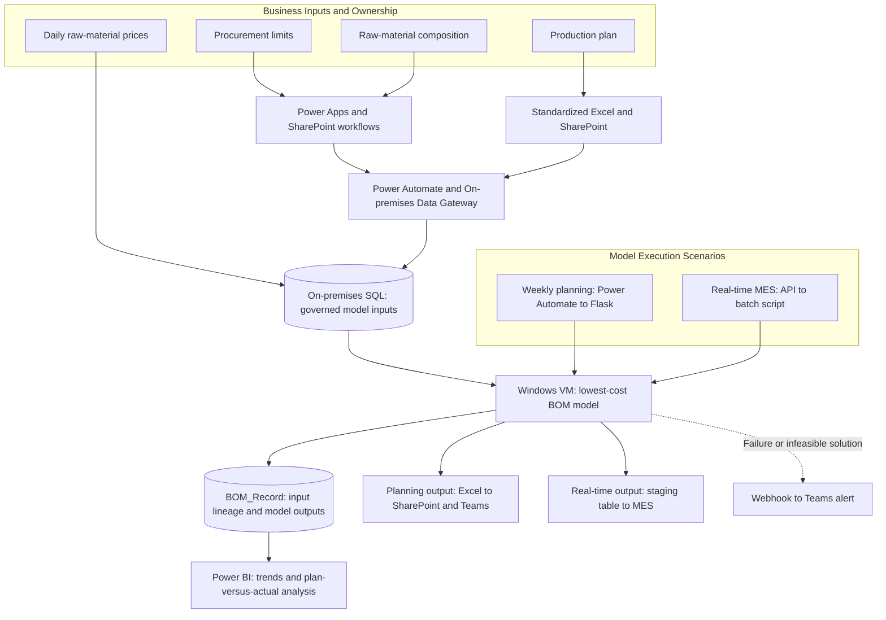

**English** | [繁體中文](README_ZH-TW.md)

# BOM Management Platform

*Operationalizing a lowest-cost BOM model for procurement planning and shop-floor execution.*

An end-to-end data and workflow platform that turned an optimization model into a repeatable business process. It governs cross-functional inputs, supports both weekly planning and real-time MES execution, and preserves full data lineage for every model run.

## Objective

Raw materials account for approximately 70% to 80% of the total cost of stainless-steel production. As prices change, so does the optimal material mix for each steel grade, making BOM decisions critical to procurement planning and cost competitiveness.

The optimization model depends on four inputs: procurement limits, raw-material composition, prices, and the production plan. Each input is owned by a different function and follows its own update cycle, format, and validation process. Without common definitions, clear ownership, and reliable data delivery, the model could not move beyond ad hoc analysis and become part of day-to-day operations.

I built the BOM Management Platform from the ground up to close that gap. The platform translates domain knowledge into governed data and repeatable workflows, gives each function ownership of its inputs, and brings lowest-cost BOM decisions into both procurement planning and shop-floor production.

## Impact

- **Operationalized the model at business scale:** Supports more than 50 raw materials across a monthly raw-material cost base of approximately NT$1 billion.
- **Connected analysis to planning and execution:** Gives procurement a rolling three-month view of material demand through weekly BOM runs, while allowing the shop floor to recalculate BOMs immediately when production schedules change.
- **Established a governed source of truth:** Standardizes the definition, source, owner, and validation method for every model input used in a BOM run.
- **Made every run reproducible:** A unique run key links the exact input versions and outputs for each calculation, enabling version comparison and root-cause analysis.
- **Created a feedback loop:** Power BI compares forecast changes and theoretical BOMs with actual material usage; automated alerts notify the team when a run fails or the model cannot find a feasible solution.

The value of the platform goes beyond automation. It connects data ownership, analytical logic, and cross-functional accountability in one decision process, allowing the lowest-cost BOM to be used, challenged, and improved over time.

## Solution

### 1. Govern the four critical inputs

I worked with the business functions that own each input to define its purpose, source, update cadence, and control requirements. The platform then applies a workflow appropriate to each data type:

| Input | Role in the model | Governance and delivery |
|---|---|---|
| Procurement limits | Represent the monthly quantities procurement expects to be available and act as supply constraints | Procurement maintains the limits in Power Apps; data is stored in SharePoint and synchronized to the on-premises SQL database |
| Raw-material composition | Provides the elemental composition used to determine feasible material mixes for each steel grade | Business users maintain the data in Power Apps; changes require approval before they are synchronized to SQL |
| Raw-material prices | Provide the economic basis for comparing feasible material combinations | A scheduled daily process generates standardized prices from procurement-defined pricing rules |
| Production plan | Defines the production volume and calculation scope for each steel grade | Production planning uploads a standardized Excel file to SharePoint; Power Automate extracts and structures the data |

These workflows do more than transfer data. They embed ownership, validation, and formatting rules into the operating process so that the model receives consistent, trusted inputs.

### 2. Automate the cross-system data flow

Microsoft 365 provides the collaboration layer: Power Apps supports parameter maintenance, SharePoint and standardized Excel files capture business inputs, and Power Automate controls the workflows and extracts data. The On-premises Data Gateway moves approved and validated inputs into the on-premises SQL database used by the model.

### 3. Use one model for two operating scenarios

Both workflows use the same lowest-cost BOM model. They differ only in the production plan, trigger, and delivery method required by the business scenario:

| Scenario | Business need | Execution and delivery |
|---|---|---|
| Weekly planning | Give procurement a three-month view of raw-material demand and support the weekly review of model constraints | Power Automate calls a Flask service on a Windows VM. The resulting Excel file is returned to SharePoint and published to Teams |
| Real-time production | Recalculate steel-grade BOMs immediately when the shop-floor schedule changes | MES calls a batch script through an API. Results are written to a staging table, and MES is notified when they are ready to retrieve |

Using one analytical model for both scenarios keeps planning and execution aligned instead of allowing separate calculation methods to develop over time.

### 4. Preserve lineage, validate results, and manage exceptions

Every run receives a time-based run key. Predefined primary-key relationships connect that run to the exact procurement limits, composition, prices, production plan, steel-grade BOMs, and aggregated material demand used or produced by the model. The records are stored in `BOM_Record`, making each result reproducible and supporting version comparison and issue investigation.

Power BI uses this history to track changes in weekly consumption forecasts and compare theoretical BOMs with actual material usage. This helps business users identify gaps among the plan, model output, and shop-floor execution.

The platform also retains an execution log for every run. A Power Automate webhook posts an alert to Teams when the application fails or the model returns no feasible solution, giving the team immediate visibility and the version context needed for root-cause analysis.

## Architecture

**My role:** I designed and built the platform end to end, from clarifying business use cases and defining data ownership and rules to implementing the workflows, data model, Power Platform automation, on-premises integration, MES interface, Power BI analysis, and run monitoring. Other team members owned the core optimization model, daily raw-material price calculation, and cost management.

## Tech Stack

| Layer | Technology | Purpose |
|---|---|---|
| Business collaboration | Power Apps, SharePoint, Excel, Teams | Parameter maintenance, production-plan submission, approvals, reviews, and result publishing |
| Data integration and automation | Power Automate, On-premises Data Gateway, webhook | Cloud-to-on-premises synchronization, workflow orchestration, model triggering, and exception alerts |
| Application integration | Flask, REST API, batch script, MES | Scheduled execution and real-time shop-floor integration |
| Data and execution | Python, SQL Server, Windows VM | Data processing, governed model inputs, versioned run data, model execution, and logging |
| Analytics | Power BI | Forecast trends, version comparison, and theoretical-versus-actual material usage analysis |

This case study contains only de-identified business context, data flows, platform architecture, and individual contributions. It excludes proprietary data, actual parameters, material numbers, formulas, connection details, and core optimization logic.
