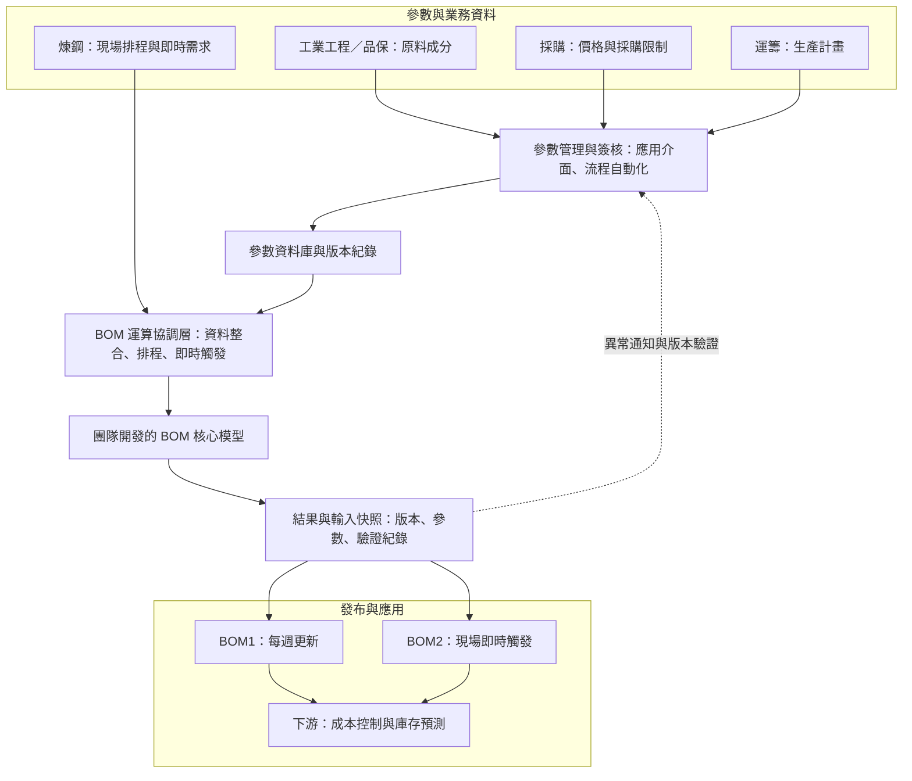

# BOM 智慧運算與管理平台

> 將人工執行、版次混亂且難以追溯的 BOM 作業，改造成具有參數治理、版本紀錄、自動發布與現場即時觸發能力的正式管理平台。

## 專案摘要

系統上線前，BOM 主要由人員手動執行，完成後再將結果上傳至協作平台。由於更新時間不固定、檔案缺乏統一版次，而且沒有完整保存每次運算所使用的價格、成分、採購限制及生產計畫，當結果出現異常時，很難還原當時條件並判斷問題來源。

本專案將參數維護、簽核、BOM 運算、輸入快照、版本管理、結果驗證及發布流程整合。BOM1 採每週定期更新，支援中期規劃；BOM2 可由現場系統即時觸發，支援即時用料決策。每次結果均與使用的參數及輸入資料一併記錄，使異常可以回溯、不同版本可以比較。

系統約於 **2023 年底上線**，目前仍持續依現場需求改版。它同時是「原料成本控制與庫存預測系統」的上游，涵蓋超過 **50 種原料**及每月約 **新台幣 10 億元**的成本管理規模。

## 專案資訊

| 項目 | 說明 |
|---|---|
| 業務領域 | 原料成本控制、採購規劃、煉鋼用料管理 |
| 專案角色 | 參數管理流程與資料平台開發、系統整合、上線維運 |
| 使用部門 | 運籌、採購、煉鋼 |
| 更新方式 | BOM1 每週更新；BOM2 現場即時觸發 |
| 上線時間 | 2023 年底，持續改版與維運 |
| 管理規模 | 超過 50 種原料、每月約新台幣 10 億元成本規模 |

## 業務問題

上線前的流程存在四個主要問題：

1. **更新時間不固定**：BOM 由人員手動執行，使用部門難以確認何時取得最新版本。
2. **版次管理混亂**：結果以檔案方式流通，缺少明確的正式版、試算版及歷史版本管理。
3. **輸入條件無法還原**：系統未完整保存每次運算所使用的參數與生產計畫，異常時難以重現當時狀態。
4. **責任與流程分散**：原料成分、價格、採購限制與生產計畫分屬不同部門，異動、確認及發布缺少一致流程。

這些問題不只影響 BOM 本身，也會向下游傳遞至原料採購、成本控制與庫存預測。

## 我的角色與責任

- 負責參數管理流程、參數資料結構與維護機制的設計及開發。
- 整合原料成分、價格、採購限制、生產計畫及現場排程等資料。
- 建立參數異動、簽核、通知與資料更新流程。
- 建立 BOM 運算的排程、即時觸發、結果發布及錯誤通知機制。
- 保存每次運算的輸入快照、參數版本與結果，支援版本比較及問題追溯。
- 建立版本管理與驗證報表，協助使用者確認正式結果及異常差異。
- 負責系統上線後的持續改版、維運與跨部門需求協調。

> BOM 核心最佳化模型由團隊其他成員主責開發；我的主要貢獻是參數與資料治理、周邊資料處理、流程自動化、版本紀錄、系統整合及上線營運。共用資料處理元件則由團隊共同開發與維護。

## 參數權責

平台將「參數由誰定義」與「系統如何管理」分開，讓專業部門保有業務判斷權，同時確保資料格式、異動流程與版本紀錄一致。

| 參數類型 | 業務負責單位 | 平台管理方式 |
|---|---|---|
| BOM1／BOM2 原料成分 | 工業工程、品保 | 異動申請、簽核、版本與更新紀錄 |
| 原料價格 | 採購 | 定期更新、運算引用與版本保存 |
| 原料採購上下限 | 採購 | 維護介面、限制檢查與版本保存 |
| 生產計畫 | 運籌生計 | 標準模板、定期更新與運算快照 |
| 現場排程與即時需求 | 煉鋼 | 現場觸發、即時資料讀取與結果回傳 |
| 參數流程與資料平台 | 本人負責 | 資料結構、流程、自動化、紀錄與維運 |

## 系統架構

下圖以去識別化名稱呈現參數治理、模型運算與結果發布的關係。

詳細說明請見 [系統架構圖](docs/architecture.md)。

## 核心流程

### 1. 參數維護與簽核

1. 業務單位透過維護介面提出參數異動。
2. 系統依參數類型送交對應權責單位確認或簽核。
3. 簽核結果、異動前後內容、申請人與時間均保留紀錄。
4. 核准後更新正式參數資料，供後續 BOM 運算使用。

### 2. BOM1 每週更新

1. 整合最新的原料價格、採購限制、原料成分及生產計畫。
2. 檢查必要欄位、資料期間與參數完整性。
3. 執行 BOM 核心模型並產生試算結果。
4. 保存輸入快照、參數版本與運算結果。
5. 完成驗證後發布正式版本，供採購與運籌規劃使用。

### 3. BOM2 即時觸發

1. 煉鋼現場透過既有系統提出運算需求。
2. 運算協調層讀取現場排程與最新正式參數。
3. 執行核心模型並保存本次輸入及結果。
4. 將結果回傳現場系統，支援即時用料決策。
5. 若資料或運算異常，系統保存錯誤紀錄並通知維運人員。

## 版本與追溯設計

每次 BOM 運算都不是只保存最後一份結果，而是同步保存影響結果的主要資訊：

- BOM 類型、運算日期與適用期間。
- 原料價格與採購上下限。
- BOM1／BOM2 原料成分。
- 生產計畫或現場排程。
- 模型輸出結果與發布狀態。
- 參數異動、簽核及錯誤紀錄。

當使用者發現原料用量或成本異常時，可以從結果版本回查當時的輸入條件，區分問題來自參數、計畫、資料或模型運算。

## 關鍵設計

### 1. 將跨部門參數變成可治理的資料

專業參數仍由各權責部門決定，但透過統一介面、簽核與資料結構管理，避免以郵件或個別檔案維護不同版本。

### 2. 區分週期性規劃與現場即時需求

BOM1 維持每週更新，支援採購與中期規劃；BOM2 則由現場系統即時觸發。兩種更新方式共用正式參數與版本紀錄，兼顧穩定規劃與現場反應速度。

### 3. 結果與輸入快照一起保存

版本管理不只記錄輸出檔案，也記錄本次運算使用的參數與計畫，使異常分析具有可追溯的證據。

### 4. 將核心模型包裝成正式營運流程

平台在模型前後加入資料檢查、排程、即時觸發、格式轉換、結果保存、發布及通知，使分析模型能穩定進入日常作業。

## 專案成果

- 將 BOM 從不定期人工執行，提升為 **BOM1 每週更新、BOM2 即時觸發**的正式流程。
- 建立統一的版本、輸入快照與參數紀錄，改善異常時難以追溯的問題。
- 明確化工業工程、品保、採購、運籌及煉鋼之間的參數權責。
- 串接參數管理、核心模型、驗證、發布與現場使用流程。
- 支援超過 **50 種原料**及每月約 **新台幣 10 億元**的成本管理規模。
- 成為原料成本控制與庫存預測系統的上游資料基礎。
- 2023 年底上線後持續運作，並依實際需求持續改版。

## 與下游專案的關係

BOM 平台提供各鋼種在不同期間的原料耗用基礎。下游的原料成本控制與庫存預測系統，再將 BOM 結果與庫存、進貨及生產計畫整合，推估未來原料耗用與庫存風險。

> 延伸案例：[原料成本控制與庫存預測系統](https://github.com/ChienChienChien/Material_Forecasting_System)

## 挑戰與解法

| 挑戰 | 解法 |
|---|---|
| 參數分散於多個部門，異動方式不一致 | 建立統一維護介面、權責流程與正式資料來源 |
| 手動運算時間不固定，版本容易混淆 | 建立固定排程、即時觸發與正式發布流程 |
| 結果異常時無法還原當時輸入 | 將參數、計畫、排程與結果以同一版本保存 |
| 核心模型需要與現場系統協作 | 建立運算協調與結果回傳介面，隔離模型與前端系統 |
| 業務規則持續變動 | 將參數與流程分離，透過版本與持續維運降低改版風險 |

## 使用技術

| 技術 | 用途 |
|---|---|
| Python／Pandas | 資料整合、參數處理、運算協調、結果與版本紀錄 |
| SQL／關聯式資料庫 | 正式參數、輸入快照、模型結果與歷史版本保存 |
| Power Apps | 參數維護與使用者輸入介面 |
| Power Automate | 簽核、通知、排程、結果發布與跨系統流程 |
| SharePoint | 表單資料、參數異動與流程協作 |
| Power BI | 版本管理、輸入參數及結果驗證報表 |
| 輕量 API 服務 | 觸發批次運算、取得結果並銜接既有系統 |

## 後續精進方向

- 增加參數異動影響分析，讓使用者在核准前預覽可能的成本與用料變化。
- 強化版本差異說明，自動標示造成結果變化的主要參數。
- 擴充資料品質規則與異常分類，縮短問題定位時間。
- 持續降低流程中的人工確認點，提高發布與回復效率。

## 資料與保密說明

本案例依實際專案重新整理，僅呈現業務問題、個人貢獻、分析方法與去識別化架構。公開內容未包含任職公司的原始資料、實際料號、價格、配方、採購限制、帳號、連線資訊、內部資料表名稱、完整程式碼及核心模型細節。

