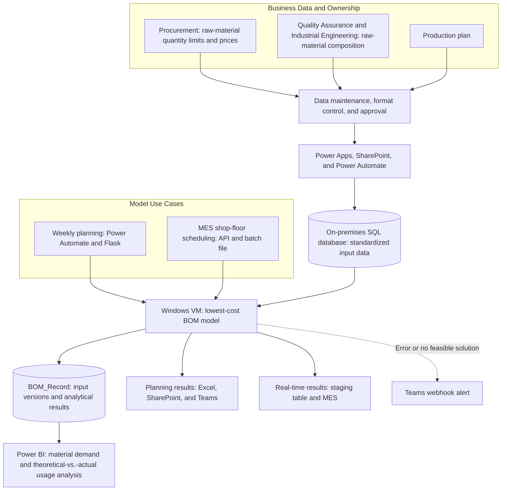

**English** | [繁體中文](README_ZH-TW.md)

# BOM Management Platform | Lowest-Cost BOM Data and Decision Platform

Transform the cross-functional data, business rules, and usage workflows required by the lowest-cost BOM model into a governed, traceable day-to-day operations platform that continuously supports decision-making.

## Purpose

The cost of raw materials account for approximately 70% to 80% of the total cost of stainless-steel manufacturing. Fluctuations in raw-material prices change the optimal material mix for each steel grade, directly affecting procurement planning and cost competitiveness.

The lowest-cost BOM model relies on four major inputs: Raw material quantity limits, raw material composition, raw material prices, and production plans. These inputs are owned by different functions and vary in update frequency, data format, validation method, and use case. In order to manage the inputs and provide reliable data for the lowest-cost BOM model, we established standardized and automated processes by defining consistent data definitions, business rules, and collaboration workflows.

We built the BOM Management Platform from the ground up, translating each function’s domain expertise into data definitions, maintenance rules, and automated workflows. Each stakeholder group owns the data within its domain and jointly reviews BOM results, embedding the decision logic for the lowest-cost BOM into day-to-day operations.

## Outcomes

- **Established a shared foundation for data and rules:** Standardized the definitions, sources, ownership, and validation methods for the four major inputs, creating a single source of truth for BOM calculations.
- **Integrated BOM results into two use cases:** Weekly runs produce steel-grade BOMs and aggregated material demand for the next three months, supporting procurement planning and weekly reviews. The shop floor can also recalculate BOMs immediately when schedules change instead of waiting for the next weekly run.
- **Made every BOM reproducible and traceable:** Each run generates a unique key that links the raw-material quantity limits, composition, prices, production plan, and BOM output used in that run, making it possible to reconstruct the exact data conditions behind the result.
- **Established a process for validation and continuous improvement:** Power BI tracks changes in weekly consumption forecasts and compares theoretical BOMs with actual material usage, allowing users to review gaps between model results and operations.
- **Scale:** The platform supports more than 50 raw materials representing approximately NT$1 billion in monthly material costs.

The platform’s greatest value goes beyond workflow automation. It connects data, models, and cross-functional roles and responsibilities into a shared decision-making process, enabling the lowest-cost BOM to be continuously adopted, validated, and improved.

## Approach

### 1. Input definitions and management approach

Define the business owner, use case, update frequency, and data requirements for each of the four major inputs, then design a management approach based on the characteristics of each input.

| Input | Management approach |
|---|---|
| Raw material quantity limits | Procurement maintains the limits in Power Apps. The data is written to SharePoint and then synchronized to the on-premises SQL database |
| Raw material composition | The data is maintained in Power Apps. Changes must be approved by the relevant functions before being synchronized to the SQL database |
| Raw material prices | Standardized prices are generated on a daily schedule based on pricing definitions provided by procurement |
| Production plan | The production planning team uploads a standardized Excel template to SharePoint, and Power Automate converts the file into structured data |

These workflows do more than move data — they embed data standards, maintenance ownership, and validation rules into day-to-day operations, creating a reliable input foundation for the model.

### 2. Build cross-system data flows

Establish a cross-functional data exchange process using the Microsoft 365 platform.

Power Apps, Excel, and SharePoint support parameter maintenance; Power Automate handles workflow orchestration and data extraction; and the on-premises data gateway synchronizes the data with the on-premises SQL database.

### 3. Deploy the lowest-cost BOM model across different use cases

| Use case | Need | Execution and delivery |
|---|---|---|
| Weekly planning | Raw material requirements for the next three months | Power Automate calls a Flask server on a Windows VM to run the model. The Excel output is pushed to SharePoint and published to Teams |
| Real-time shop-floor production | Generate updated BOMs for each steel grade in response to scheduling changes | MES calls a batch file through an API to run the model. The results are written to a staging table, and MES is notified when they are ready to retrieve |

This design enables the same calculation logic to support both material planning and real-time operations, preventing different use cases from developing inconsistent calculation methods.

### 4. BOM Versioning, Tracking, Analytics, and Exception Management

Each model run generates a unique, time-based run key. The key uses a standardized primary-key structure to link the raw material constraints, composition, prices, production plan, and BOM output used in that run.

Using `BOM_Record` as the data source, Power BI visualizes changes in monthly raw-material demand and compares the theoretical BOM with actual material inputs, supporting ongoing monitoring, optimization, and process improvement of the lowest-cost BOM model.

If an error occurs or the model returns no feasible solution in either use case described in **Section 3**, the system sends a Teams notification through a Power Automate webhook. The team can then respond promptly and investigate the issue using the versioned data.

## Architecture

*Note: The core lowest-cost BOM model, raw material price calculations, and cost management were handled by other members of the team.*

## Technologies

| Capability | Technologies | Use in the project |
|---|---|---|
| User Collaboration and Interfaces | Power Apps, SharePoint, Excel | Parameter maintenance and production plan submission |
| Data Workflows and Automation | Power Automate, On-premises Data Gateway, Webhook, Teams | Cloud-to-on-premises data synchronization, workflow orchestration, model triggering, and exception notifications |
| Data Processing and Application Integration | Flask, Python, SQL Server, Windows Server | Model integration, scheduled execution, and real-time shop-floor calculations |
| Analytics and Decision Support | Power BI | Material demand and theoretical-versus-actual usage analysis |

This case study presents only de-identified business context, data flows, platform architecture, and individual contributions. It does not include company source data, actual parameters, material numbers, formulas, connection details, or details of the core model.
