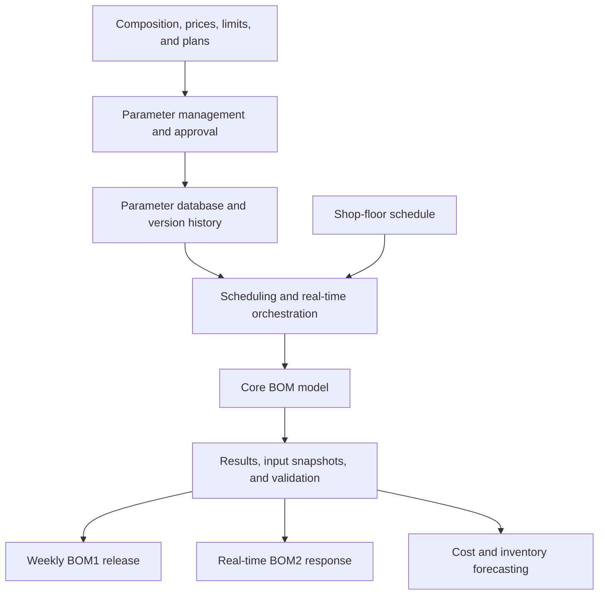

[繁體中文](README.md) | **English**

# Bill of Materials (BOM) Planning and Governance Platform

Established a shared BOM management process that enables logistics, procurement, and steelmaking teams to plan and operate from the same parameters, versions, and published results. The platform integrates parameter maintenance, approval, calculation, version control, and publishing; it runs BOM1 weekly and triggers BOM2 in real time from shop-floor operations. It covers more than **50 raw materials** and provides upstream data for raw-material cost and inventory forecasting.

## Project Overview

| Item | Description |
|---|---|
| Business users | Logistics, procurement, and steelmaking |
| My role | Parameter and data governance, system integration, automation, production support |
| Update model | BOM1 weekly; BOM2 triggered in real time |
| Go-live | Late 2023, with ongoing maintenance and enhancement |
| Scale | More than 50 raw materials; approximately NT$1 billion monthly cost base |

## Business Challenge

BOM runs were performed manually and uploaded to Teams on an irregular schedule. File versions and calculation inputs were not fully recorded, making it difficult to reconstruct the parameters and production plan used when a result required investigation.

## Approach

- Established a standardized process for parameter maintenance, approval, and release.
- Integrated material composition, price, procurement limits, production plans, and shop-floor schedules.
- Scheduled BOM1 weekly for planning and enabled real-time BOM2 requests from shop-floor systems.
- Stored parameter versions, input snapshots, calculation results, and release status together.
- Built validation reports, exception notifications, and historical version lookup.

## Parameter Ownership

| Parameter | Business owner |
|---|---|
| BOM1 and BOM2 material composition | Industrial engineering and quality assurance |
| Material prices and procurement limits | Procurement |
| Production plan | Logistics production planning |
| Shop-floor schedule and real-time demand | Steelmaking |
| Parameter workflow and data platform | My responsibility |

Business teams own the domain decisions. I designed and maintained the data structure, workflow, version history, and operating platform.

## Architecture

## My Contributions

- Designed the parameter-management workflow, data structure, and maintenance process.
- Built parameter change, approval, notification, and update workflows.
- Integrated model inputs and implemented scheduled and real-time execution.
- Stored input snapshots, parameter versions, and results for comparison and traceability.
- Managed publishing, exception notifications, production support, and cross-functional requirements.

The core optimization model was led by another team member. My primary responsibility covered parameter and data governance, surrounding data processing, workflow automation, and system integration. Shared data-processing components were co-developed by the team.

## Key Outcomes

- Replaced irregular manual runs with **weekly BOM1 updates and real-time BOM2 execution**.
- Established parameter, input, and output version history for auditability and issue analysis.
- Clarified ownership across industrial engineering, quality assurance, procurement, logistics, and steelmaking.
- Supports more than **50 raw materials** and a monthly cost base of approximately **NT$1 billion**.
- Provides upstream data for the [Raw Material Inventory Forecasting and Alert System](https://github.com/ChienChienChien/Material_Forecasting_System/blob/master/README_EN.md).

## Technology

Python, Pandas, SQL, relational databases, Power Apps, Power Automate, SharePoint, Power BI, and APIs.

## Confidentiality

This case study presents de-identified business context, individual contributions, and system architecture only. It excludes proprietary data, material numbers, prices, formulas, connection details, internal table names, complete source code, and core model details.
