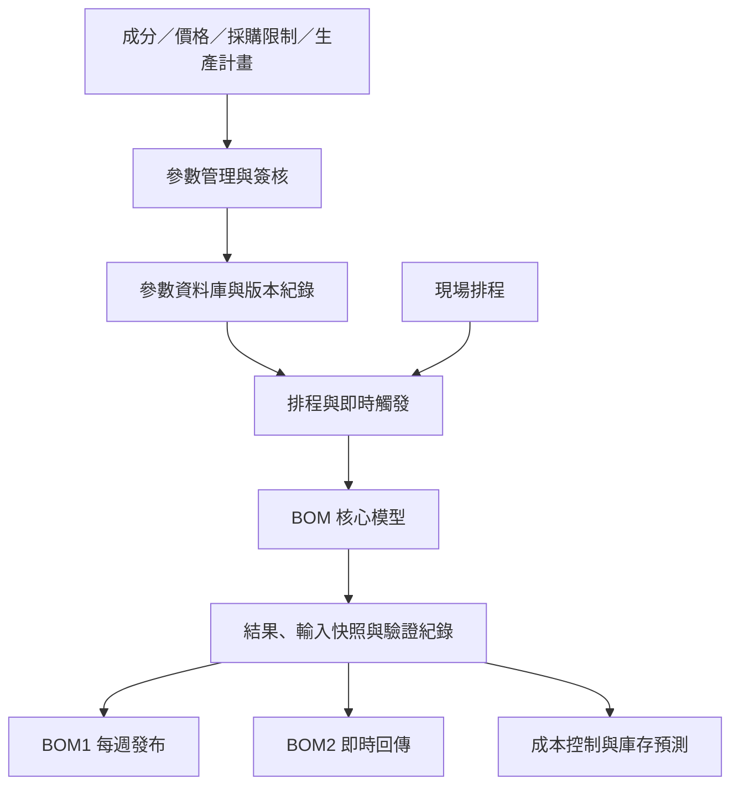

[English](README.md) | **繁體中文**

# BOM 智慧運算與管理平台

建立跨部門的BOM 管理機制，透過參數的管理介面以及自動化流程，使協作單位能夠參與其中，使用共同的平台以及資訊做決策。平台整合參數維護、簽核、運算、版本及發布流程，同時強化BOM 版次的追蹤管理，目前涵蓋超過 **50 種原料**，並作為原料成本與庫存預測系統的上游資料基礎。

## 專案概況

| 項目 | 說明 |
|---|---|
| 使用部門 | 運籌、採購、煉鋼 |
| 個人職責 | 參數與資料管理、系統整合、自動化、上線維運 |
| 更新方式 | BOM1 每週更新；BOM2 現場即時觸發 |
| 上線時間 | 2023 年底，持續維運與改版 |
| 管理規模 | 超過 50 種原料；每月成本約新台幣 10 億元 |

## 問題

上線前由人員手動執行 BOM，再將結果上傳至 Teams。更新時間不固定，檔案版次難以管理，也未完整保存價格、成分、採購限制及生產計畫等輸入條件。結果異常時，難以還原當時狀態及判斷問題來源。

## 作法

- 建立統一的參數維護、簽核及發布流程。
- 整合原料成分、價格、採購限制、生產計畫與現場排程。
- BOM1 採每週排程，供中期規劃使用；BOM2 由現場即時觸發。
- 同步保存參數版本、輸入快照、運算結果及發布狀態。
- 建立驗證報表、異常通知及歷史版本查詢。

## 參數權責

| 參數 | 業務負責單位 |
|---|---|
| BOM1／BOM2 原料成分 | 工業工程、品保 |
| 原料價格及採購上下限 | 採購 |
| 生產計畫 | 運籌生計 |
| 現場排程與即時需求 | 煉鋼 |
| 參數流程與資料平台 | 本人負責 |

各單位負責專業內容；我負責資料結構、維護流程、版本紀錄及系統運作。

## 系統架構

詳細流程請見 [系統架構](docs/architecture.md)。

## 個人貢獻

- 設計參數管理流程、資料結構及維護機制。
- 建立參數異動、簽核、通知及資料更新流程。
- 整合模型所需資料，建立排程與即時觸發機制。
- 保存輸入快照、參數版本及結果，支援比較與追溯。
- 負責發布、錯誤通知、上線維運，以及跨部門作業流程與資料定義協調。

BOM 核心最佳化模型由團隊其他成員主責；我的工作重點為參數與資料治理、周邊資料處理、流程自動化及系統整合。共用資料處理元件由團隊共同開發。

## 成果

- 將人工、不定期作業改為 **BOM1 每週更新、BOM2 即時觸發**。
- 建立參數、輸入及結果的版本紀錄，改善版次管理與異常追溯。
- 明確化工業工程、品保、採購、運籌與煉鋼的參數權責。
- 支援超過 **50 種原料**及每月約 **新台幣 10 億元**成本規模。
- 成為[原料進耗存預測與庫存告警系統](https://github.com/ChienChienChien/Material_Forecasting_System)的上游資料基礎。

## 使用技術

Python、Pandas、SQL、關聯式資料庫、Power Apps、Power Automate、SharePoint、Power BI、API。

## 保密說明

本案例僅呈現去識別化的業務問題、個人貢獻與系統架構，不含公司原始資料、料號、價格、配方、連線資訊、內部資料表名稱、完整程式碼及核心模型細節。
