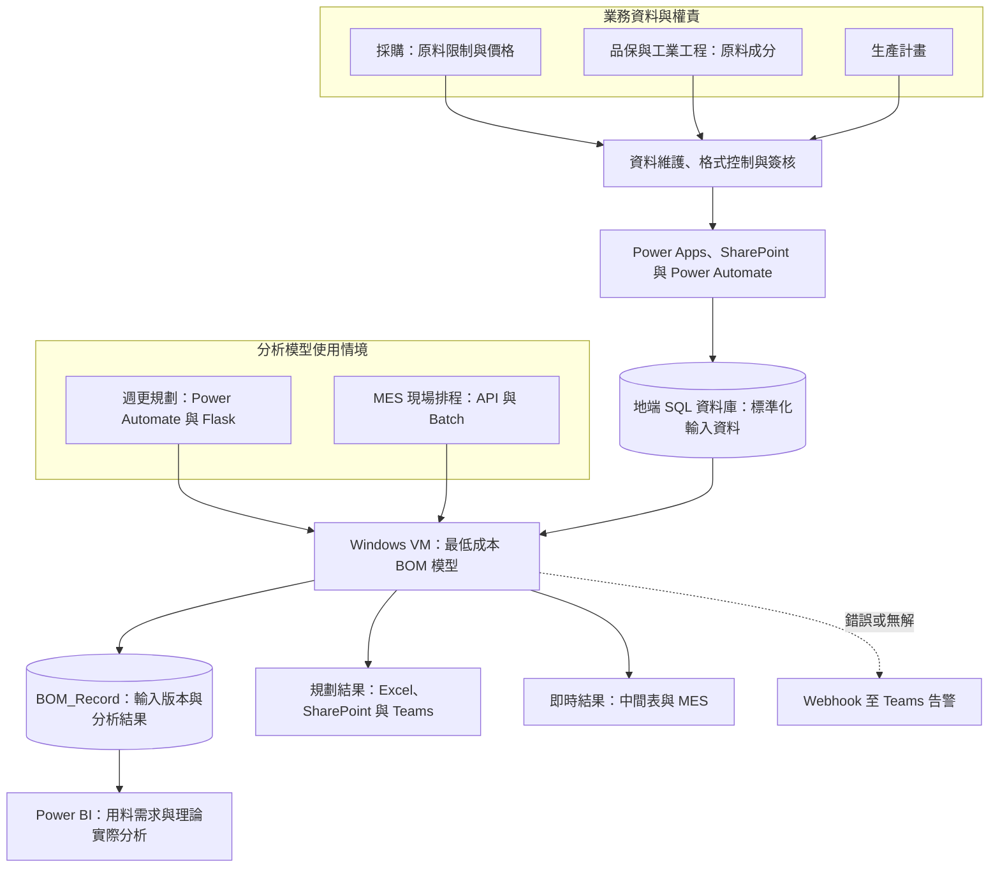

[English](README.md) | **繁體中文**

# BOM Management Platform｜最低成本 BOM 資料與決策平台

將最低成本 BOM 模型所需的跨部門資料、業務規則與使用流程，轉化為可治理、可追溯且能持續支援決策的日常營運平台。

## 目的

不鏽鋼製造的原料成本約占總成本 70% 至 80%，原料價格波動會改變各鋼種的最適原料組合，直接影響採購規劃與成本競爭力。

最低成本 BOM 模型包含四類關鍵輸入參數：原料限制、原料成分、原料價格與生產計畫。這些資料由不同單位掌握，更新頻率、資料格式、確認方式與使用情境也不相同。因此，本專案建立一致的資料定義、業務規則與協作流程，透過標準化與自動化機制管理輸入參數，為最低成本 BOM 模型建立可信任的資料基礎。

本專案從零建立 BOM Management Platform，將各單位的專業判斷轉化為資料定義、維護規則與自動化流程，使各協作單位負責自己掌握的資料，並共同檢視 BOM 結果，讓最低成本 BOM 的決策邏輯真正融入日常營運。

## 成果

- **建立共同的資料與規則基礎：** 將四大輸入參數的定義、來源、維護責任與確認方式納入一致流程，形成 BOM 計算所使用的單一事實來源（Single Source of Truth）。
- **把BOM結果帶入兩類決策情境：** 每週產出未來三個月的各鋼種 BOM 與原料加總用量，支援採購規劃及週會檢討；現場則可依排程變化即時計算，不必等待下一次週更。
- **使每次BOM結果可重現與追溯：** 每次執行都產生唯一識別 Key，串接當次的原料限制、成分、價格、生產計畫與輸出 BOM，可完整還原模型當時使用的資料條件。
- **建立結果驗證與持續改善機制：** 透過 Power BI 比較每週耗用預估變化，以及理論 BOM 與實際投料差異，讓使用單位能持續檢視模型結果與營運落差。
- **管理規模：** 平台支援超過 50 種原料及每月約新台幣 10 億元的原料成本規模。

這個平台最大的價值不只是自動化流程，而是把資料、模型與跨部門權責連結成共同的決策流程，讓最低成本 BOM 能被持續使用、驗證與改善。

## 作法

### 1. 輸入參數之定義與管理模式

確認四類關鍵輸入參數的定義、使用情境、業務負責單位以及更新頻率，再依資料特性設計不同的管理方式：

| 輸入參數 | 管理方式 |
|---|---|
| 原料限制 | 透過 Power Apps 維護，寫入 SharePoint 後同步至地端 SQL 資料庫 |
| 原料成分 | 透過 Power Apps 維護，異動須經相關單位簽核後才同步至 SQL 資料庫 |
| 原料價格 | 依採購提供的價格定義，每日排程產出標準化價格 |
| 生產計畫 | 生產計畫單位依固定 Excel 格式上傳 SharePoint，再由 Power Automate 轉為結構化資料 |

這些流程不只負責搬運資料，也將資料格式、維護責任與確認規則嵌入日常作業，建立模型可以信任的輸入基礎。

### 2. 建立跨系統資料流程

以 Microsoft 365 平台建立跨部門資料交換流程。

Power Apps、Excel 搭配 Sharepoint 作為參數維護介面，Power Automate 負責流程控制及資料擷取，再透過 On-premises Data Gateway 將資料同步至地端 SQL 資料庫。

### 3. 將最低成本 BOM 模型導入不同使用情境

| 使用情境 | 需求 | 執行與交付方式 |
|---|---|---|
| 週更規劃 | 未來三個月的原料需求 | Power Automate 呼叫 Windows VM 上的 Flask Server 執行模型；結果以 Excel 回傳 SharePoint 並發布至 Teams |
| 現場即時生產 | 因應臨時排程變化，立即取得各鋼種的新 BOM | MES 透過 API 呼叫 Batch File 執行模型；結果寫入中間表，完成後通知 MES 取回 |

這項設計讓同一套計算邏輯同時支援用料規劃與即時營運，避免不同使用情境各自發展不一致的計算方式。

### 4. 建立 BOM 版本資料模型、追蹤分析與例外管理

每次模型執行都會依時間產生唯一識別 Key，並透過固定的 Primary Key 規範，串接當次的原料限制、成分、價格、生產計畫與輸出 BOM。這些資料保存於 `BOM_Record` ，使每個分析結果都能對應回完整的輸入版本，支援結果重現、版本比較與問題追查。

以`BOM_Record` 作為資料來源，利用 Power BI 呈現每月用料需求的變化，並比較理論 BOM 與實際投料，用以後續最低成本 BOM 模型之追蹤、優化與流程精進。

若 **作法 3** 的使用情境中發生錯誤或模型求解無解，系統會透過 Power Automate Webhook 將訊息推送至 Teams，讓團隊能即時掌握狀況並依版本資料進行問題分析。

## 架構

*Noted : 最低成本 BOM 核心模型，以及原料價格計算與成本管理，分別由團隊其他成員負責*

## 技術

| 能力 | 使用技術 | 在專案中的用途 |
|---|---|---|
| 使用者協作與介面 | Power Apps、SharePoint、Excel | 參數維護、生產計畫提交 |
| 資料流程與自動化 | Power Automate、On-premises Data Gateway、Webhook、Teams | 跨雲端與地端的資料同步、流程控制、模型觸發與異常通知 |
| 資料處理與應用系統整合 | Flask、Python、SQL Server、Windows Server | 串接模型、週期性執行與現場即時計算 |
| 分析與決策支援 | Power BI | 用料需求、理論與實際投料差異分析 |

本案例僅呈現去識別化的業務背景、資料流程、平台架構與個人貢獻，不包含公司原始資料、實際參數、料號、配方、連線資訊與核心模型細節。
