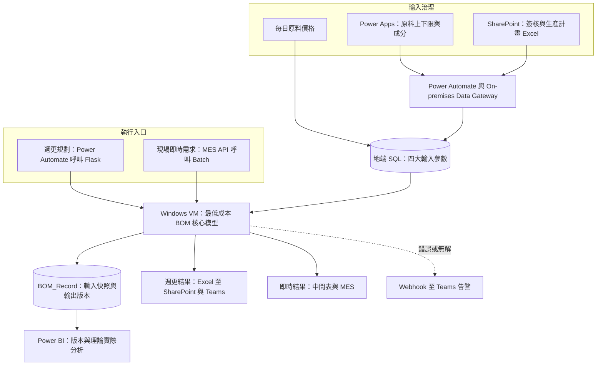

[English](README.md) | **繁體中文**

# BOM Management Platform｜最低成本 BOM 營運平台

將最低成本模型從單次運算工具，轉化為具備參數治理、雙模式運算、版本追溯與跨部門協作的日常營運平台。

## 目的

不鏽鋼製造的原料成本約占總成本 70%，因此 BOM 不只是用料清單，也直接影響採購規劃與成本競爭力。然而，最低成本模型若只停留在個別人員執行的分析工具，就難以持續影響實際營運。

模型需要原料上下限、原料成分、原料價格與生產計畫四類關鍵輸入，而這些資料分別由不同單位掌握。若缺少共同流程，即使模型本身能求得最佳解，也可能因參數未更新、資料格式不一致、版本不明或權責分散而無法穩定落地。

本專案從零建立 BOM Management Platform，將資料維護、簽核、模型執行、結果發布與版本紀錄串成完整流程。平台把資料規範與部門權責嵌入系統，使各協作單位負責自己掌握的輸入，並共同檢視 BOM 結果，讓最低成本思維真正進入採購規劃與現場生產。

## 成果

- **將模型轉化為正式營運流程：** 最低成本 BOM 不再依賴單次人工執行，而是成為持續運作的平台，支援超過 50 種原料及每月約新台幣 10 億元的原料成本規模。
- **建立跨部門資料權責：** 採購、品保、工業工程、生產計畫與煉鋼單位依各自專業維護或確認參數，平台以格式、簽核與發布規則確保協作一致性。
- **同時支援規劃與生產：** 每週產出未來三個月的耗用預估 BOM，支援採購規劃及週會檢討；現場則可依排程變化即時計算各鋼種 BOM，不必等待下一次週更。
- **使每次運算可追溯：** 每次執行都產生唯一識別 Key，串接當次的原料上下限、成分、價格、生產計畫與輸出 BOM，可完整還原模型當時使用的條件。
- **形成持續檢視機制：** 透過 Power BI 比較每週耗用預估變化，以及理論 BOM 與實際投料差異；計算錯誤或模型無解時，系統會即時通知相關團隊。

這個平台最大的價值不只是節省人工操作，而是讓模型、資料與組織權責形成同一套營運機制，使最低成本 BOM 能被持續使用、檢視與改善。

## 作法

### 1. 依資料特性建立輸入治理

四類輸入參數由不同單位負責，也需要不同的控制方式：

| 輸入參數 | 管理方式 | 流程目的 |
|---|---|---|
| 原料上下限 | 採購透過 Power Apps 維護，資料寫入 SharePoint，再經 On-premises Data Gateway 同步至地端 SQL | 將可採購量轉化為模型限制條件 |
| 原料成分 | 透過 Power Apps 維護，異動須經簽核後才同步至 SQL | 確保成分調整獲得相關單位確認 |
| 原料價格 | 每日排程產出標準化價格，供模型執行時使用 | 讓模型使用一致且最新的價格基礎 |
| 生產計畫 | 生產計畫單位依固定 Excel 格式上傳 SharePoint，由 Power Automate 擷取並寫入 SQL | 將中期生產需求轉為可自動處理的結構化資料 |

流程不只負責搬運資料，也把維護責任、格式規範與簽核條件納入系統控制，建立模型可以信任的輸入基礎。

### 2. 建立週期性與即時兩種運算模式

- **週更規劃模式：** Power Automate 呼叫地端 Windows VM 上的 Flask Server，啟動核心模型並產出未來三個月的各鋼種 BOM 與原料加總用量。結果以 Excel 回傳 SharePoint，再發布到 Teams，作為採購規劃與每週檢討的共同依據。
- **現場即時模式：** MES 透過 API 呼叫包含 BOM 執行程式的 Batch File。計算完成後，結果寫入中間表，系統再呼叫 API 通知 MES 取回結果，使煉鋼單位能因應臨時排程變化即時取得新的 BOM。

兩種模式使用相同的最低成本核心模型，但採用不同的生產計畫與交付方式，分別服務中期規劃和現場生產。

### 3. 將輸入、結果與運行狀態一起管理

每次模型執行都依時間產生唯一識別 Key，並將四類輸入參數、各鋼種 BOM 與原料加總結果保存於既有 SQL Database 的 `BOM_Record` 資料模型中。這使平台不只保留最終檔案，也能重建每個版本的完整運算情境。

Power BI 使用這些紀錄呈現耗用預估的版本變化，並比較理論 BOM 與實際投料。模型執行同時保留 Log；若程式發生錯誤或求解無解，則透過 Power Automate Webhook 將訊息推送至 Teams，讓團隊即時掌握運行狀況。

## 架構

核心最低成本模型由團隊另一位成員主責；我負責平台從零到一的設計與開發，包括參數治理、Power Platform 流程、地端整合、雙模式執行、MES 串接、版本資料模型、Power BI 分析及運行監控。原料成本的計算與管理則由另一位同仁負責。

## 技術

| 層次 | 使用技術 | 主要用途 |
|---|---|---|
| 使用者與協作 | Power Apps、SharePoint、Excel、Teams | 參數維護、生產計畫上傳、簽核與結果發布 |
| 流程自動化 | Power Automate、Approval、Webhook | 資料同步、流程控制、模型觸發與異常通知 |
| 地端整合 | On-premises Data Gateway、Flask、REST API、Batch File | 連接 Microsoft 365、Windows VM、SQL 與 MES |
| 資料與運算 | Python、SQL Server、Windows VM | 資料處理、模型執行、輸入快照、版本及 Log 管理 |
| 分析與驗證 | Power BI | 版本變化、耗用預估及理論與實際投料差異分析 |

本案例僅呈現去識別化的業務背景、平台設計與個人貢獻，不包含公司原始資料、實際參數、料號、配方、連線資訊與核心模型細節。
