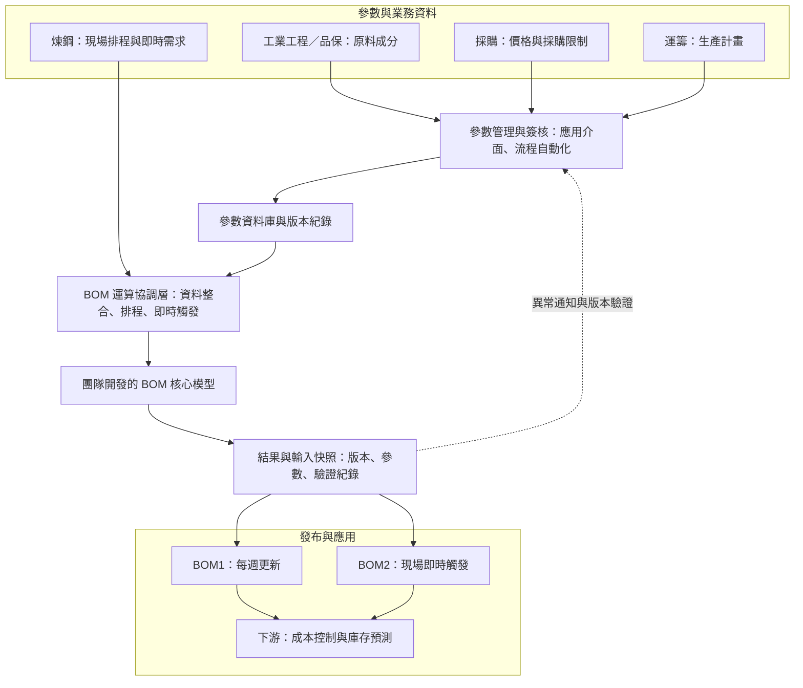
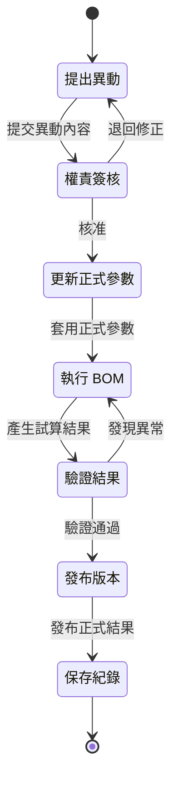
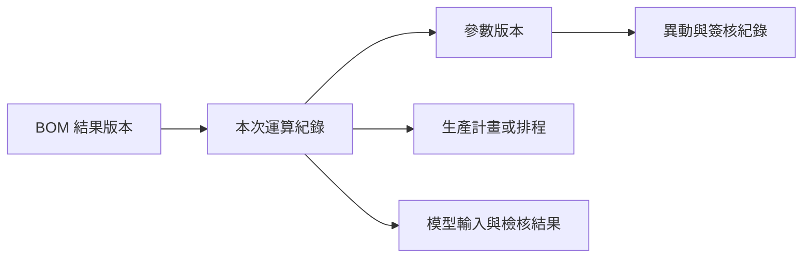

**繁體中文** | [English](architecture_en.md)

# BOM 智慧運算與管理平台｜架構圖

## 整體架構

## 各層職責

| 層級 | 主要職責 |
|---|---|
| 參數與業務資料 | 由權責單位提供原料成分、價格、採購限制、生產計畫及現場排程 |
| 參數管理與簽核 | 提供維護介面，執行申請、簽核、通知及正式資料更新 |
| 參數資料庫與版本紀錄 | 保存正式參數、異動前後內容、簽核狀態與歷史版本 |
| BOM 運算協調層 | 整合資料、檢查輸入、處理排程或即時觸發並呼叫核心模型 |
| BOM 核心模型 | 由團隊成員主責開發，根據輸入條件產出用料結果 |
| 結果與輸入快照 | 同步保存模型結果及本次運算使用的參數、計畫與排程 |
| 發布與應用 | 發布 BOM1／BOM2，並提供下游成本與庫存預測使用 |

## 參數異動流程

## BOM1 與 BOM2

| 項目 | BOM1 | BOM2 |
|---|---|---|
| 主要用途 | 採購與中期規劃 | 現場即時用料決策 |
| 更新方式 | 每週定期更新 | 由現場系統即時觸發 |
| 主要輸入 | 正式參數、生產計畫 | 正式參數、現場排程與即時需求 |
| 共同機制 | 參數版本、輸入快照、結果紀錄、驗證與異常通知 | 參數版本、輸入快照、結果紀錄、驗證與異常通知 |

## 追溯關係

透過以上關係，使用者可從異常結果反查本次運算、參數版本、計畫／排程及參數異動來源，避免只保留輸出檔案而無法還原當時條件。

## 圖示說明

- 實線箭頭代表主要資料與流程方向。
- 虛線箭頭代表驗證結果與異常狀態回饋。
- 所有系統名稱及欄位均已去識別化。
