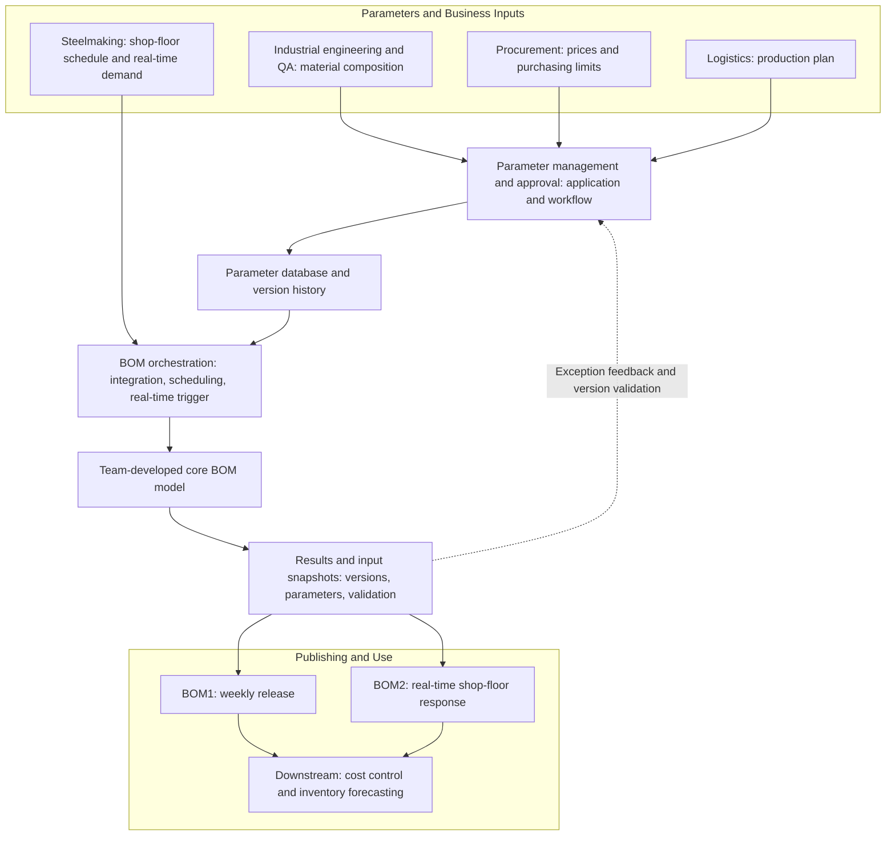
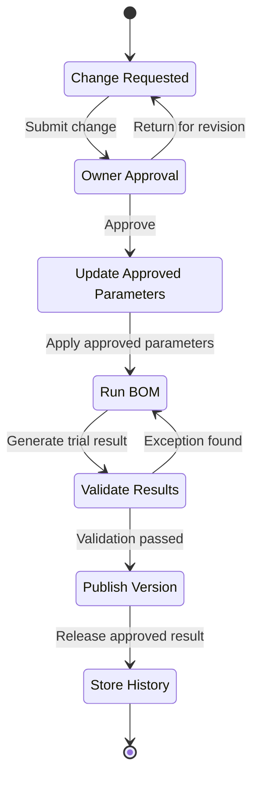
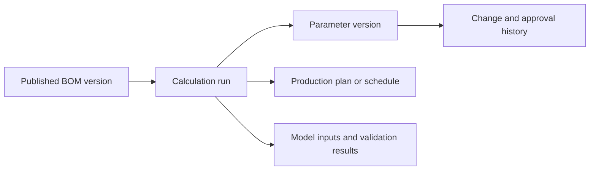

[繁體中文](architecture.md) | **English**

# Bill of Materials (BOM) Planning and Governance | System Architecture

## End-to-End Architecture

## Component Responsibilities

| Component | Responsibility |
|---|---|
| Parameters and business inputs | Domain owners provide composition, prices, purchasing limits, production plans, and shop-floor schedules |
| Parameter management and approval | Provides the maintenance interface and manages requests, approvals, notifications, and production updates |
| Parameter database and version history | Stores approved parameters, before-and-after changes, approval status, and history |
| BOM orchestration | Integrates and validates inputs, handles scheduled or real-time requests, and invokes the core model |
| Core BOM model | Produces material-use results from approved inputs; led by another team member |
| Results and input snapshots | Stores model outputs together with the parameters, plans, and schedules used for each run |
| Publishing and use | Releases BOM1 and BOM2 and supplies downstream cost and inventory forecasting |

## Parameter Change Workflow

## BOM1 and BOM2

| Item | BOM1 | BOM2 |
|---|---|---|
| Primary use | Procurement and medium-term planning | Real-time shop-floor material decisions |
| Update model | Scheduled weekly | Triggered by the shop-floor system |
| Main inputs | Approved parameters and production plan | Approved parameters, shop-floor schedule, and real-time demand |
| Shared controls | Parameter version, input snapshot, result history, validation, and exception alerts | Parameter version, input snapshot, result history, validation, and exception alerts |

## Traceability Model

This relationship allows users to trace an unexpected result back to the calculation run, parameter version, plan or schedule, validation evidence, and source change. The platform therefore retains the conditions behind each result, not only the output file.

## Diagram Notes

- Solid arrows indicate the main data and process flow.
- The dashed arrow indicates validation and exception feedback.
- All system and field names are de-identified.
